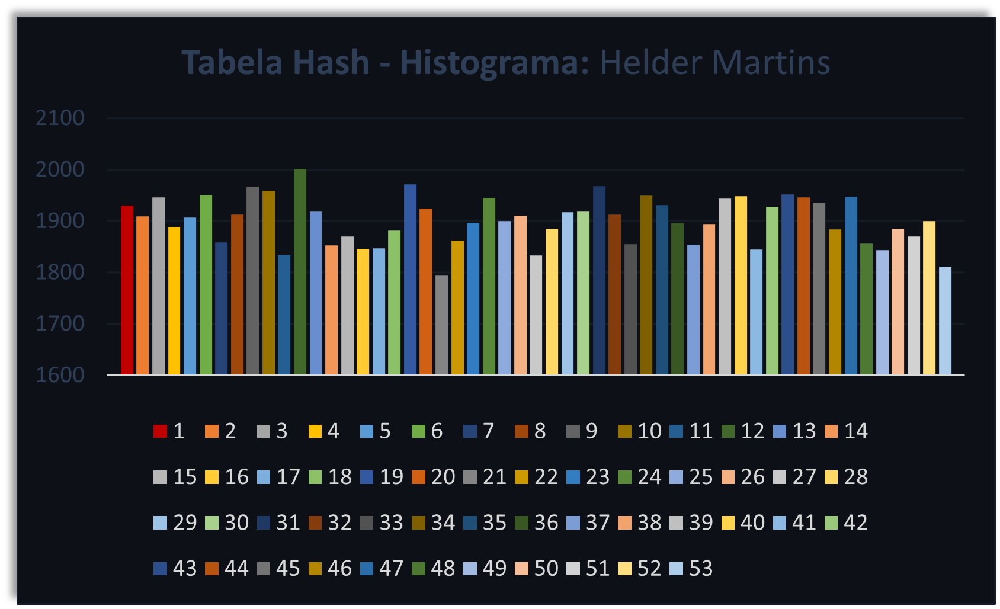

# Relatório: Implementação de uma Tabela de Espalhamento (Tabela Hash)

## O Problema
No contexto do Trabalho Final, a tarefa consistia em implementar uma Tabela de Espalhamento (Tabela Hash) utilizando uma lista encadeada dupla. O objetivo era manipular uma base de dados de nomes de brasileiros, composta por mais de 100.000 registros. Cada nome deveria ser inserido na tabela, considerando tratamento de colisão, e posteriormente, algumas operações deveriam ser implementadas, como consulta, quantidade de elementos por chave, remoção, entre outras.

## A Solução
A implementação da Tabela Hash foi realizada em linguagem C, utilizando uma função de hash que considera a letra inicial do nome convertida para inteiro (código ASCII). A tabela possui 53 chaves, e o tratamento de colisão foi realizado por meio de listas encadeadas duplas. A escolha da função de hash e a estratégia de tratamento de colisão foram justificadas com base no referencial teórico apresentado em aula.

## Método QuickSort
Método de Hoare ou algoritmo QuickSort é um método que carrega este nome justamente por conta de sua velocidade.

**Implementação do módulo `quickSort()`:**
```c
List *quickSort(List *list, int initNodo, int finalNodo) {
  Nodo *i, *j, *pivo, *aux;
  int iCont, jCont;

  i = getNodoByPos(list, initNodo);
  j = getNodoByPos(list, finalNodo);
  pivo = getPivoByPos(i, j);
  printf("\npivo -> %s", pivo->info);
  printf("\ninicial -> %i\nfinal -> %i\n", initNodo, finalNodo);
  while (getPos(list, i) <= getPos(list, j)) {
    while (isSmaller(i, pivo) == 1) {
      i = i->next;
    }
    while (isSmaller(j, pivo) == 2) {
      j = j->prev;
    }
    if (getPos(list, i) <= getPos(list, j)) {
      printf("\nantes\ni -> %s\nj -> %s\n", i->info, j->info);
      swapNodos(list, i, j);
      aux = i;
      i = j;
      j = aux;
      i = i->next;
      j = j->prev;
      printf("\ndepois\ni -> %s\nj -> %s\n", i->info, j->info);
    }
    printf("-------------------------------------------------------------------"
           "----------------------");
    printList(list);
  }
  if (getPos(list, getNodoByPos(list, initNodo)) < getPos(list, j)) {
    quickSort(list, initNodo, getPos(list, j));
  }
  if (getPos(list, i) < getPos(list, getNodoByPos(list, finalNodo))) {
    quickSort(list, getPos(list, i), finalNodo);
  }
}
```

## Avaliação e Análise
A hipótese do hashing uniforme foi avaliada considerando a distribuição dos nomes nas chaves. 
A distribuição uniforme dos nomes foi considerado um ponto de qualidade do algoritmo como um todo, dado como bem sucedido, já que
o histograma de frequência de cada chave foi analisado para verificar a uniformidade da distribuição. A implementação do algoritmo de ordenação dos elementos sob uma chave, utilizando o método quicksort, contribuiu para a organização eficiente dos dados.

## Análise com histograma (100.788x53)


### Exemplo de Saída (Output)
```
Nome encontrado na coluna 7 e posição 15
```

|  Chave |   Valor  |
|:------:|:--------:|
|   1    |   1930   |
|   2    |   1909   |
|   3    |   1946   |
... | ...
|   10   |   1959  |
... | ...
49 | 1843
50 | 1885
51 | 1870
52 | 1900
53 | 1811

## Conclusão
A proposta de projeto final usando de preceitos aprendidos e aplicados em aula pelo professor [Manassés Ribeiro](https://github.com/manassesribeiro) atendeu às especificações propostas, implementando com sucesso a Tabela Hash com lista encadeada dupla. A escolha da função de hash e a estratégia de tratamento de colisão proporcionaram uma distribuição adequada dos elementos, e a implementação do quicksort contribuiu para operações eficientes de consulta e ordenação.
